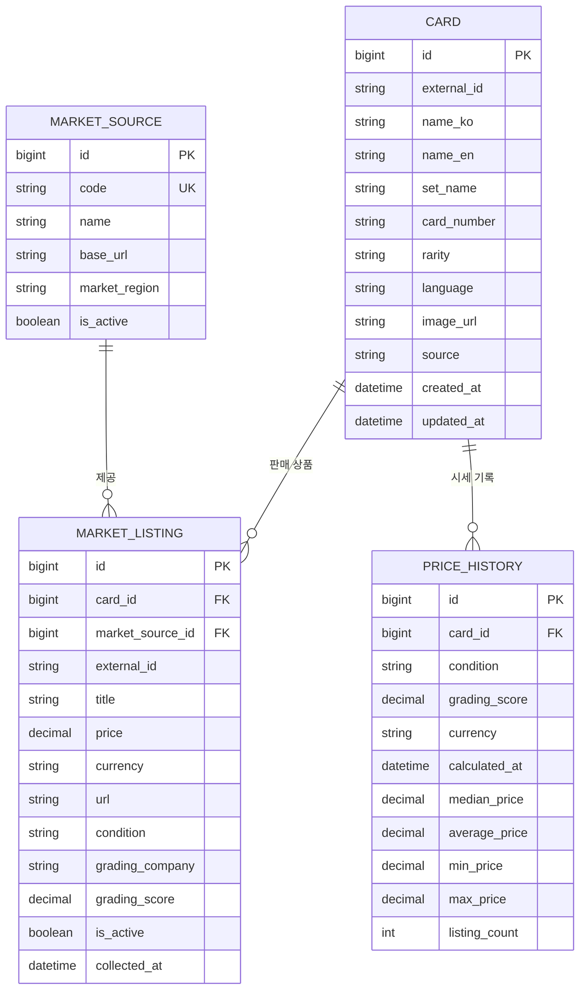

# Pokemon Card Market - Phase 1 설계

## 1. 설계 범위와 원칙

이 문서는 `PROJECT_GUIDE.md`의 Phase 1 완료 조건을 정리한 설계 문서다.
Phase 1에서는 Django 프로젝트, 모델, 화면, Collector를 실제로 구현하지 않는다.
실제 외부 데이터 출처와 API도 선택하지 않는다. 데이터 출처는 사용 가능 여부와
이용 약관을 확인하는 Phase 4와 Phase 6에서 각각 결정한다.

초기 버전의 기준은 다음과 같다.

- Django App은 하나만 사용한다.
- 모델은 가이드의 핵심 모델 네 개를 유지한다.
- 수집, 매칭, 상태 분류, 시세 계산은 작은 모듈로 분리한다.
- AI, 비동기 작업, Scheduler, 별도 프론트엔드는 사용하지 않는다.
- 데이터 갱신은 나중에 Django 관리 명령으로 수동 실행한다.
- 매칭이 불확실한 데이터는 억지로 저장하지 않고 결과 보고서에 남긴다.
- 일반 사용자는 계정 없이 조회 기능을 사용하며 사용자용 인증 기능은 만들지 않는다.
- Django Admin 인증은 개발자/관리자 전용으로만 유지한다.

## 2. 전체 프로젝트 및 폴더 구조

Phase 2 이후 만들 목표 구조다. 현재 Phase에서는 아래 파일을 생성하지 않는다.

```text
포켓몬/
├── manage.py
├── config/                    # 프로젝트 설정과 최상위 URL
│   ├── __init__.py
│   ├── settings.py
│   ├── urls.py
│   ├── asgi.py
│   └── wsgi.py
├── cards/                     # 카드, 판매 상품, 시세를 담당하는 단일 App
│   ├── migrations/
│   ├── collectors/            # 외부 데이터 수집만 담당
│   │   ├── __init__.py
│   │   ├── base.py
│   │   ├── card_data/
│   │   │   └── __init__.py
│   │   └── markets/
│   │       └── __init__.py
│   ├── management/
│   │   └── commands/
│   │       ├── import_cards.py
│   │       └── update_prices.py
│   ├── services/              # 외부 통신과 무관한 비즈니스 로직
│   │   ├── card_importer.py
│   │   ├── normalization.py
│   │   ├── card_matching.py
│   │   ├── condition_classifier.py
│   │   └── price_calculator.py
│   ├── templates/
│   │   └── cards/
│   ├── tests/
│   │   ├── test_card_matching.py
│   │   ├── test_condition_classifier.py
│   │   ├── test_price_calculator.py
│   │   └── test_models.py
│   ├── admin.py
│   ├── apps.py
│   ├── models.py
│   ├── urls.py
│   └── views.py
├── templates/
│   └── base.html
├── static/
├── docs/
│   └── PHASE1_DESIGN.md
├── .env                       # Git에 포함하지 않음
├── .gitignore
├── PROJECT_GUIDE.md
├── README.md
└── requirements.txt
```

`cards` 하나로 시작한다. 현재 핵심 기능은 모두 Card를 중심으로 이어지므로 App을
카드, 판매, 시세로 나누면 초기에 설정과 모델 간 참조만 복잡해진다. 기능 규모가
실제로 커졌을 때만 App 분리를 다시 검토한다.

## 3. Django App 구성

| 구성 | 책임 |
|---|---|
| `config` | settings, 최상위 URL, ASGI/WSGI 설정 |
| `cards.models` | 네 개 모델과 단순한 선택값 정의 |
| `cards.views` | 카드 목록, 검색, 상세 화면 요청 처리 |
| `cards.collectors` | 허용된 외부 출처에서 원본 데이터를 가져오고 공통 형식으로 변환 |
| `cards.services` | 문자열 정규화, 카드 매칭, 상태 분류, 시세 계산 |
| `cards.management.commands` | 전체 갱신 흐름을 사용자가 수동 실행하는 진입점 |
| `cards.tests` | 핵심 비즈니스 규칙 검증 |

Collector는 DB 저장이나 시세 계산을 직접 책임지지 않는다. 관리 명령이 Collector와
서비스를 순서대로 호출한다. 이 구분만 지키면 복잡한 계층이나 디자인 패턴은 필요 없다.

## 4. DB 모델 설계

실제 Django 필드 선언은 Phase 3에서 한다. 아래의 제약 조건도 Phase 3에서 SQLite로
검증한다.

### 4.1 Card

포켓몬 카드 한 종류의 기준 정보다.

| 필드 | 예상 형식 | 필수 | 설명 |
|---|---|---:|---|
| `id` | 기본키 | 예 | Django 기본 PK |
| `external_id` | 문자열, nullable | 아니요 | 카드 정보 출처의 고유 ID |
| `name_ko` | 문자열 | 예 | 한글 카드명 |
| `name_en` | 문자열 | 아니요 | 영문 카드명 |
| `set_name` | 문자열 | 예 | 수록 세트명 |
| `card_number` | 문자열 | 예 | `201/165`처럼 앞의 0과 `/`를 보존 |
| `rarity` | 문자열 | 아니요 | SAR 등 레어도 |
| `language` | 짧은 문자열 | 예 | 카드 언어. 기본정보와 매칭에서 필요해 추가 |
| `image_url` | URL 문자열 | 아니요 | 카드 이미지 원본 URL |
| `source` | 문자열 | 예 | 카드 기본정보 출처 식별자 |
| `created_at` | 일시 | 예 | 생성 시각 |
| `updated_at` | 일시 | 예 | 수정 시각 |

중복 방지 규칙은 다음 순서로 적용한다.

1. `source + external_id`가 있으면 이것을 가장 먼저 사용한다.
2. 없으면 정규화한 `set_name + card_number + language`로 기존 카드를 찾는다.
3. 그래도 판단할 수 없으면 `name_ko + set_name + card_number + language`를 비교한다.
4. 한 후보로 확정되지 않으면 자동 생성하지 않고 미처리 사유를 보고한다.

`language`는 가이드의 예상 필드에는 없지만 동일 번호의 다른 언어판을 잘못 합치지
않기 위해 추가한다. 데이터 출처가 정해지면 고유 제약의 세부 기준을 검증한다.

### 4.2 MarketSource

판매 데이터 출처의 설정 정보다. 후보 사이트를 미리 데이터로 만들지 않는다.

| 필드 | 예상 형식 | 필수 | 설명 |
|---|---|---:|---|
| `id` | 기본키 | 예 | Django 기본 PK |
| `code` | 고유 문자열 | 예 | 내부 식별용 코드 |
| `name` | 문자열 | 예 | 화면 표시명 |
| `base_url` | URL 문자열 | 아니요 | 확인된 공식 기본 주소 |
| `market_region` | 선택 문자열 | 예 | 국내 `KR` 또는 해외 `GLOBAL` |
| `is_active` | 불리언 | 예 | 수집 사용 여부 |

실제로 사용 가능한 출처가 확정될 때만 레코드를 등록한다.

### 4.3 MarketListing

외부 판매처에서 확인한 개별 판매 상품의 최신 상태다.

| 필드 | 예상 형식 | 필수 | 설명 |
|---|---|---:|---|
| `id` | 기본키 | 예 | Django 기본 PK |
| `card` | Card FK | 예 | 매칭된 카드 |
| `market_source` | MarketSource FK | 예 | 판매 출처 |
| `external_id` | 문자열 | 예 | 출처가 제공하는 상품 ID 또는 확인된 공개 URL의 안정적인 식별 부분 |
| `title` | 문자열 | 예 | 원본 상품명 |
| `price` | 소수 둘째 자리 십진수 | 예 | USD 센트 등 해당 통화의 소수 단위를 보존한 가격 |
| `currency` | 3자리 문자열 | 예 | KRW, USD, EUR 등의 통화 코드 |
| `url` | URL 문자열 | 예 | 원본 상품 페이지 |
| `condition` | 선택 문자열 | 예 | RAW, PSA, BGS, CGC, SEALED, UNKNOWN |
| `grading_company` | 선택 문자열, nullable | 아니요 | PSA, BGS, CGC |
| `grading_score` | 십진수, nullable | 아니요 | 10, 9.5 등의 등급 |
| `is_active` | 불리언 | 예 | 최신의 완전한 수집에서 판매 중인지 여부 |
| `collected_at` | 일시 | 예 | 마지막으로 확인한 시각 |

`market_source + external_id`를 고유하게 하여 같은 상품을 갱신할 때 새 행을 계속
만들지 않는다. 외부 ID가 없는 출처는 공개 상품 URL에서 안정적인 키를 얻을 수 있는지
Phase 6에서 확인한다. 안정적인 키가 없으면 해당 출처는 바로 구현하지 않는다.

`is_active`는 사라진 상품이 현재 시세에 계속 섞이는 일을 막기 위한 작은 추가 필드다.
수집이 성공적으로 끝난 범위에서만 미확인 상품을 비활성화한다. 실패했거나 일부 페이지만
수집한 경우에는 기존 상품을 비활성화하지 않는다.

### 4.4 PriceHistory

특정 카드와 상태의 한 시점 시세 계산 결과다.

| 필드 | 예상 형식 | 필수 | 설명 |
|---|---|---:|---|
| `id` | 기본키 | 예 | Django 기본 PK |
| `card` | Card FK | 예 | 계산 대상 카드 |
| `condition` | 선택 문자열 | 예 | MarketListing과 같은 상태값 |
| `grading_score` | 십진수, nullable | 아니요 | PSA/BGS/CGC일 때 등급별 시세를 분리하기 위한 값 |
| `currency` | 3자리 문자열 | 예 | 서로 다른 통화의 시세 기록을 분리하는 코드 |
| `calculated_at` | 일시 | 예 | 계산 시각 |
| `median_price` | 소수 둘째 자리 십진수 | 예 | 대표 시세 |
| `average_price` | 소수 둘째 자리 십진수 | 예 | 참고용 산술평균 |
| `min_price` | 소수 둘째 자리 십진수 | 예 | 포함된 가격 중 최솟값 |
| `max_price` | 소수 둘째 자리 십진수 | 예 | 포함된 가격 중 최댓값 |
| `listing_count` | 양의 정수 | 예 | 이상치 처리 후 계산에 포함된 상품 수 |

판매처별 통계나 일별 별도 모델은 만들지 않는다. 같은 갱신 실행에서 같은
`card + condition + grading_score + currency` 결과는 한 번만 저장한다. RAW와
SEALED의 `grading_score`는 비워 둔다. 이 필드는 가이드의
예상 필드에는 없지만 PSA 9와 PSA 10의 가격이 섞이지 않도록 하기 위해 추가한다.
`currency`는 eBay의 USD와 향후 국내 KRW가 섞이는 것을 막기 위해 추가했다.

## 5. 모델 관계와 삭제 정책

- MarketSource 1개에는 MarketListing 여러 개가 연결된다.
- Card 1개에는 MarketListing 여러 개가 연결된다.
- Card 1개에는 PriceHistory 여러 개가 연결된다.
- 참조 중인 Card와 MarketSource는 실수로 삭제되지 않도록 `PROTECT`를 우선 사용한다.
- 잘못 수집된 개별 MarketListing과 계산 결과인 PriceHistory는 관리자에서 별도로 정리한다.

## 6. ERD



## 7. Collector 구조

### 7.1 공통 원칙

`collectors/base.py`에는 Collector가 반환해야 하는 공통 데이터 모양과 기본 오류만
정의한다. 복잡한 추상 클래스나 플러그인 등록 구조는 만들지 않는다. 실제 출처가
결정된 뒤 `card_data/` 또는 `markets/` 아래에 출처별 파일을 하나씩 추가한다.

Phase 4에서 `CardData` dataclass와 `fetch`, `normalize`, `collect` 메서드를 가진
간단한 `CardDataCollector` 기본 인터페이스를 구현했다. 실제 출처별 Collector와
네트워크 요청은 사용 가능 여부가 확정된 경우에만 추가한다. JustTCG 공식 stable v1
Collector는 `game=pokemon`, `language=Korean`으로 소량 호출하며, 빈 `variants`인
Card는 저장하지 않는다. 실제 제한 조회에서는 Korean variant를 찾지 못해 DB import는
대기 중이다.

Collector가 담당하는 일:

- 허용된 공식 API 또는 합법적으로 사용 가능한 데이터에 요청한다.
- Rate Limit, timeout, 응답 오류를 숨기지 않고 보고한다.
- 외부 응답을 프로젝트의 공통 필드 이름으로 정규화한다.
- 한 번의 수집 결과와 오류 목록을 호출자에게 돌려준다.

Collector가 담당하지 않는 일:

- 카드 매칭 규칙 결정
- 상태별 시세 계산
- View 또는 HTML 처리
- Scheduler 실행
- 확인되지 않은 주소나 비공개 API 사용

### 7.2 CardDataCollector

반환할 공통 데이터는 `external_id`, 카드명, 세트명, 카드번호, 레어도, 언어,
이미지 URL, 출처 코드다. 출처가 주지 않는 선택 정보는 빈 값으로 두되, 필수 식별
정보가 없으면 저장 후보에서 제외하고 오류 사유를 남긴다.

### 7.3 MarketCollector

반환할 공통 데이터는 `external_id`, 제목, 가격, 통화, URL, 수집 시각, 출처 코드다.
카드 FK, 상태, 등급은 Collector가 임의로 만들지 않고 이후 서비스가 결정한다.

판매가격 출처로 공식 eBay Browse API의 `item_summary/search`를 선택해
`EbayMarketCollector`를 구현했다. Application access token은 OAuth Client Credentials로
메모리에만 받아 만료 전까지 재사용한다. Collector는 카드 FK나 상태를 결정하지 않는다.
eBay 데이터는 `GLOBAL`인 해외 참고 가격이며 국내 시세로 취급하지 않는다. 실제 인증정보가
없으므로 네트워크 성공 검증은 대기하고, 공식 응답 형태의 Mock으로 파싱과 오류를 검증한다.

## 8. 카드 기본정보 자동 등록 흐름

```text
사용자가 수동 관리 명령 실행
→ CardDataCollector가 확인된 외부 데이터 요청
→ 필수값 검사 및 문자열 정규화
→ source + external_id로 기존 Card 검색
→ 없으면 세트 + 카드번호 + 언어 등으로 중복 검색
→ 기존 카드 한 개가 확정되면 변경된 정보만 갱신
→ 중복이 없으면 새 Card 생성
→ 여러 후보이거나 필수값이 부족하면 저장하지 않고 결과 보고
```

처리 건수는 생성, 갱신, 건너뜀, 오류로 나누어 콘솔에 표시한다. 한 항목의 오류 때문에
전체 원인을 숨기지는 않되, DB 일관성을 위해 적절한 단위로 transaction을 사용한다.

이 흐름은 `cards/services/card_importer.py`에 구현되었다. 현재 `import_cards` 관리
명령은 실제 Collector가 설정되지 않았다는 안내만 출력하며 DB에 샘플 데이터를 넣지 않는다.

## 9. 판매가격 수집과 전체 데이터 흐름

```text
사용자가 수동 갱신 명령 실행
→ 활성 MarketSource의 MarketCollector 실행
→ 가격·URL·필수값 검증 및 문자열 정규화
→ 상품 제목을 Card와 매칭
→ 상태 및 등급 분류
→ source + external_id로 MarketListing 생성 또는 갱신
→ 기존 상품은 삭제하거나 임의 비활성화하지 않음
→ 활성 상품을 Card + condition + grading_score + currency별로 묶음
→ 유효하지 않은 가격 제외 및 이상치 처리
→ median, average, min, max, listing_count 계산
→ PriceHistory 저장
→ 생성·갱신·미매칭·오류·계산 결과를 콘솔에 표시
```

가격이 해당 통화 기준의 양수가 아니거나 통화가 확인되지 않은 값은 제외한다.
국내/해외 구분과 통화 코드는 원본 기준으로 보존한다. 환율을 임의 적용하지 않고,
서로 다른 통화의 가격을 하나의 시세로 합치지 않는다. 외부 요청이 실패하면 그 범위의
기존 상품을 비활성화하거나 새 시세를 저장하지 않는다.

초기에는 이 흐름을 Django 관리 명령으로 필요할 때마다 수동 실행한다. 반복 실행할 수
있는 구조로 만들되 Scheduler는 구현하지 않는다. 실제 배포 후 데이터 출처의 Rate
Limit과 이용 조건을 확인하고 필요성이 있을 때만 자동 갱신과 주기를 검토한다.

## 10. 동일 카드 매칭 방식

먼저 비교용 문자열에서 앞뒤 공백, 연속 공백, 영문 대소문자, 일반적인 구분 기호를
통일한다. 원본 제목은 MarketListing에 그대로 보존한다.

매칭 우선순위는 다음과 같다.

1. 제목에 완전한 카드번호가 있으면 같은 카드번호 후보만 찾는다.
2. 후보가 여러 개면 카드명 일치로 줄인다.
3. 그래도 여러 개면 세트명, 언어, 레어도 일치 순서로 좁힌다.
4. 카드번호가 없으면 카드명과 세트명이 모두 확인되는 경우만 후보로 삼는다.
5. 최종 후보가 정확히 한 개일 때만 자동 연결한다.
6. 후보가 없거나 둘 이상이면 미매칭으로 보고하고 MarketListing을 저장하지 않는다.

부분 문자열 오탐을 줄이기 위해 카드번호와 등급 숫자는 단어 경계를 고려한다.
초기에는 점수 기반 퍼지 매칭, AI, 머신러닝을 사용하지 않는다. 테스트 사례가 쌓인 뒤에도
정확성이 설명 가능한 규칙만 먼저 개선한다.

## 11. 상태 및 등급 분류 방식

상태 분류는 원본 제목을 정규화한 뒤 명확한 키워드만 사용한다.

1. `PSA`, `BGS`, `CGC`와 유효한 등급 숫자가 함께 있으면 해당 회사 상태로 분류하고
   `grading_company`, `grading_score`를 저장한다.
2. 등급 회사는 있으나 점수를 안전하게 읽지 못하면 `UNKNOWN`으로 두고 자동 시세에서
   제외한다.
3. 미개봉을 명확히 뜻하는 검증된 키워드가 있으면 `SEALED`로 분류한다.
4. 단일 카드로 확실히 매칭되었고 등급/미개봉 키워드가 없으면 `RAW`로 분류한다.
5. 서로 충돌하는 키워드, 묶음 상품, 상태 판단이 불가능한 제목은 `UNKNOWN`으로 분류한다.

점수는 1~10 범위의 정수 또는 한 자리 소수만 허용하는 방안을 Phase 8 테스트에서
확정한다. `PSA 10`과 `RAW`는 항상 별도 그룹으로 계산한다. `UNKNOWN`은 보관할 수는
있지만 대표 시세 계산에는 포함하지 않는다.

## 12. 가격 검증과 이상치 처리 방식

이상치 처리 전에 다음 기본 검증을 한다.

- 가격이 비어 있거나 숫자가 아니면 제외한다.
- 0 이하 가격은 제외한다.
- 배송비, 할인가, 월 납부액처럼 상품 가격이 아니라고 확인된 값은 제외한다.
- 서로 다른 상태와 등급 회사의 가격을 한 그룹에 섞지 않는다.
- 서로 다른 통화의 가격을 한 그룹에 섞지 않는다.

초기 이상치 방식은 설명 가능한 IQR 방식을 후보로 사용한다.

1. `Card + condition`별 활성 가격 목록을 만든다.
2. 표본이 5개 미만이면 이상치를 제거하지 않는다.
3. 표본이 5개 이상이면 Python 표준 라이브러리의 inclusive 사분위수 방식으로
   Q1, Q3, IQR(`Q3 - Q1`)을 계산한다.
4. `Q1 - 1.5 × IQR`보다 작거나 `Q3 + 1.5 × IQR`보다 큰 값만 제외 후보로 본다.
5. 제거 후 값이 3개 미만이면 제거 전 데이터로 계산하고 경고를 남긴다.

이 기준은 Phase 9에서 예제 및 경계값 테스트로 검증한다. 테스트에서 가격 왜곡이나
과도한 제거가 확인되면 이유와 변경 내용을 기록한 뒤 조정한다. 지금 임의의 가격
상·하한을 정하지 않는다.

## 13. 통합 시세 계산 방식

계산 단위는 `Card + condition + grading_score + currency`이며, `is_active=True`인 유효한
MarketListing만 사용한다. 선택한 판매 출처 중 하나라도 갱신에 실패하면 오래된 값과
새 값이 섞인 기록을 남기지 않도록 그 카드의 새 PriceHistory 계산을 건너뛴다.

1. 기본 검증과 이상치 처리를 통과한 가격 목록을 만든다.
2. `median`을 대표 시세로 계산한다.
3. 산술 `average`는 참고값으로 계산하고 통화 소수 둘째 자리로 반올림한다.
4. `min`, `max`, `listing_count`를 같은 최종 목록에서 계산한다.
5. 최종 데이터가 없으면 PriceHistory를 만들지 않고 "계산 자료 없음"을 보고한다.
6. 결과가 있으면 한 실행 시점당 `Card + condition + grading_score + currency` 하나의
   PriceHistory를 저장한다.

등급 회사 상태인 PSA, BGS, CGC는 회사별로 분리된다. 같은 회사 안에서 등급 점수까지
가격을 분리하기 위해 nullable `grading_score`를 사용한다. condition 값을
`PSA_10`처럼 계속 늘리는 방식은 사용하지 않는다. 등급 점수가 없는 PSA/BGS/CGC
상품은 UNKNOWN과 마찬가지로 대표 시세 계산에서 제외한다.

`MarketListing.currency`와 `PriceHistory.currency`로 통화를 구분한다. 다른 통화를
합산하거나 환율 변환하지 않는다.

## 14. 웹 URL 구조

| URL | 이름 | 목적 |
|---|---|---|
| `/` | `home` | 검색창과 카드 목록 |
| `/cards/` | `card-list` | `?q=리자몽` 형태의 검색 및 목록 |
| `/cards/<int:pk>/` | `card-detail` | 카드 정보, 상태별 시세, 상품, 가격 변화 |
| `/admin/` | Django Admin | 네 모델 관리 |

별도 API URL과 일반 사용자용 회원가입, 로그인, 로그아웃, 프로필, 소셜 로그인,
즐겨찾기 및 사용자별 기능은 프로젝트 범위에 넣지 않는다. `/admin/`만 Django 관리자
인증을 사용하며 공개 조회 페이지와 혼동하지 않는다. 검색 URL과 카드 목록 URL은
하나로 합쳐 View 수를 줄인다.

## 15. 오류 처리와 보안 경계

- API 키와 Secret은 코드나 문서 예시에 쓰지 않고 `.env` 등 환경변수로 관리한다.
- timeout, 인증 오류, Rate Limit 오류를 성공으로 처리하지 않는다.
- 로그인, CAPTCHA, 접근 제한, 차단을 우회하지 않는다.
- 수집 실패 시 기존 정상 데이터와 시세를 파괴하지 않는다.
- 원본 URL과 외부 문자열은 Django Template의 기본 escaping을 유지한다.
- 로그에 Secret이나 전체 인증 헤더를 남기지 않는다.

## 16. Phase 2 이후 개발 계획

| Phase | 작업 및 완료 확인 |
|---:|---|
| 2 | `.venv`로 Django 프로젝트와 단일 `cards` App 생성, settings/URL/초기 페이지 구성, 개발 서버 실행 확인 |
| 3 | 네 모델과 필요한 제약·인덱스 구현, migration 및 Admin 등록, 등급 점수별 PriceHistory 모델 테스트 |
| 4 | 카드 정보 출처의 공식성·약관·Rate Limit 검토 후 하나를 확정하고 CardDataCollector 구현. 확정 불가 시 TODO 유지 |
| 5 | 카드 목록, 검색, 상세 화면을 Django Template로 구현 |
| 6 | eBay 공식 Browse API MarketCollector와 OAuth 구현. Mock 완료, 실제 인증 검증 대기 |
| 7 | 정규화와 보수적 카드 매칭 구현 및 미매칭 테스트 |
| 8 | RAW/PSA/BGS/CGC/SEALED/UNKNOWN 분류와 등급 인식 테스트 |
| 9 | 기본 가격 검증, IQR 기준 실험, 상태·점수별 통계 계산 및 테스트 |
| 10 | 통화별 PriceHistory 저장과 상태·등급·통화별 Chart.js 그래프 구현 |
| 11 | `python manage.py update_prices` 수동 갱신 명령 구현 및 실패 안전성 확인 |
| 12 | Bootstrap과 모바일 화면 사용성 개선 |
| 13 | 전체 기능, 오류, 예외, 중복 방지 회귀 테스트 |
| 14 | 실제 구현 내용에 맞춰 README와 실행·환경변수·테스트 방법 정리 |
| 15 | 로컬 핵심 기능 확인 후 호스팅을 검토하고 배포 |

각 Phase는 해당 기능을 실제 실행하거나 테스트한 뒤에만 완료 표시한다.

## 17. Phase 1 완료 조건 점검

- [x] 전체 프로젝트 구조
- [x] Django App 구성
- [x] 폴더 구조
- [x] DB 모델
- [x] 모델 관계
- [x] ERD
- [x] CardDataCollector 구조
- [x] MarketCollector 구조
- [x] 카드 자동 등록 흐름
- [x] 판매가격 수집 흐름
- [x] 동일 카드 매칭 방식
- [x] 상태 분류 방식
- [x] 이상치 처리 방식
- [x] 시세 계산 방식
- [x] 웹 URL 구조
- [x] Phase 2 이후 개발 계획

이 설계는 단일 App과 네 개 핵심 모델을 유지하며, 초기에 불필요한 저장소 계층,
작업 큐, Scheduler, AI, 별도 API 서버를 추가하지 않는다.
